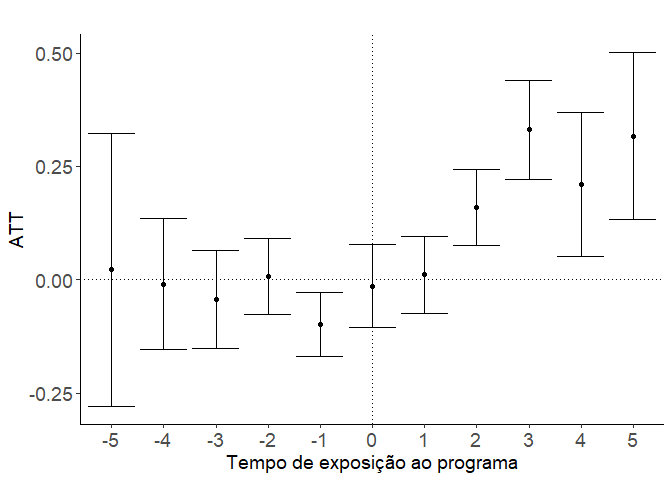
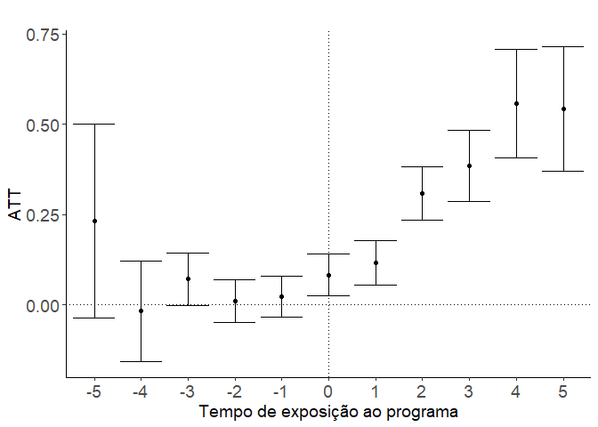
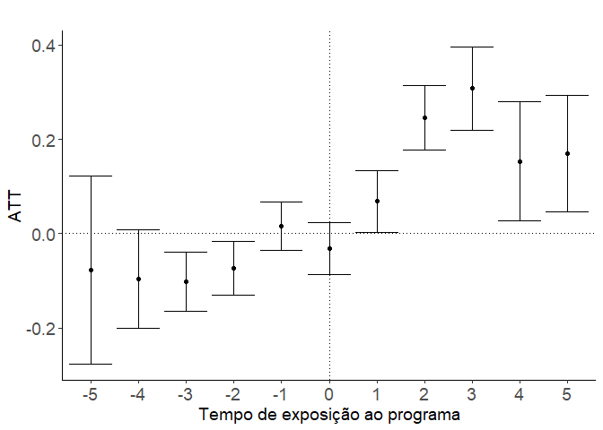
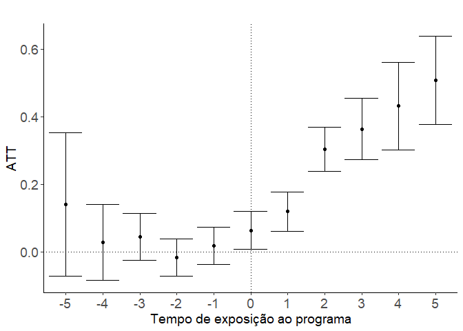
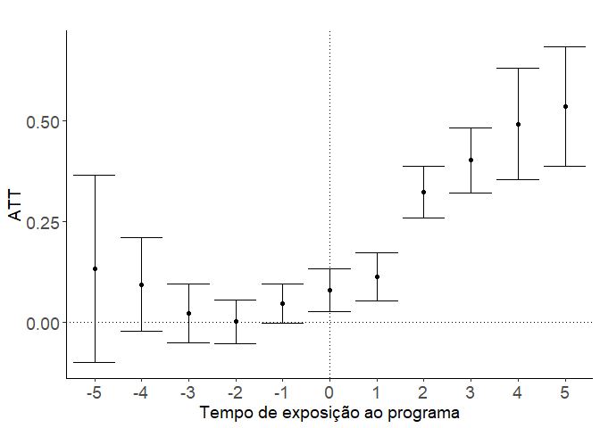
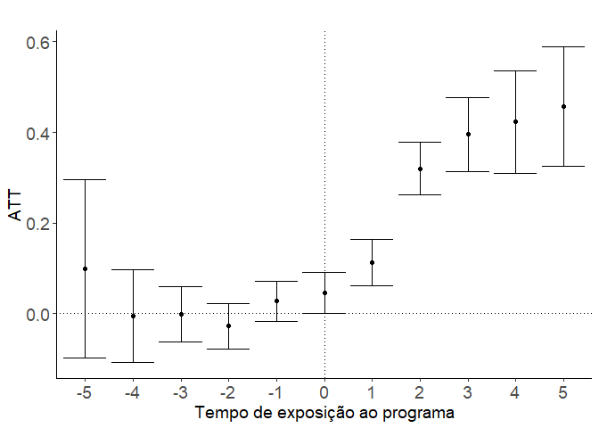
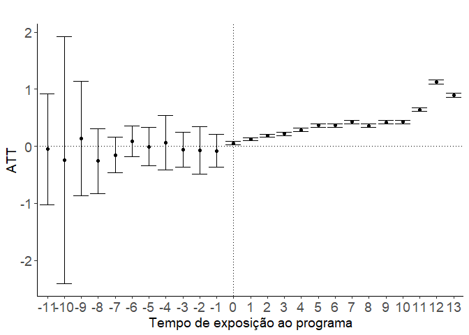
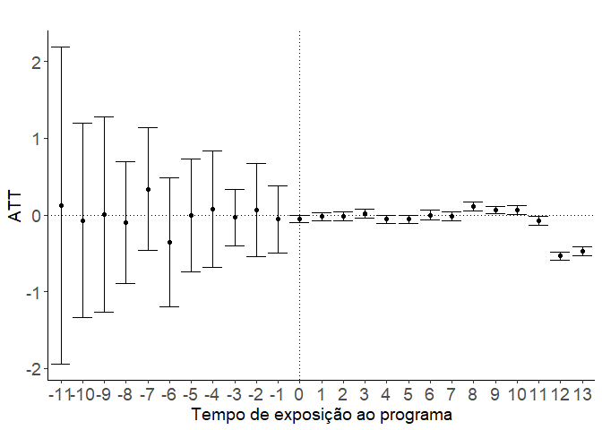
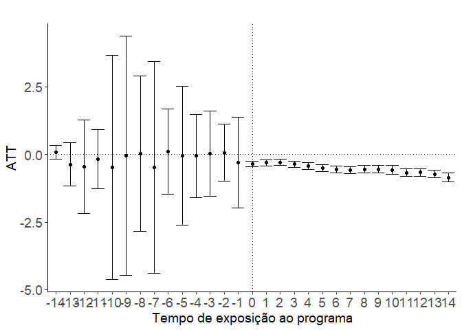
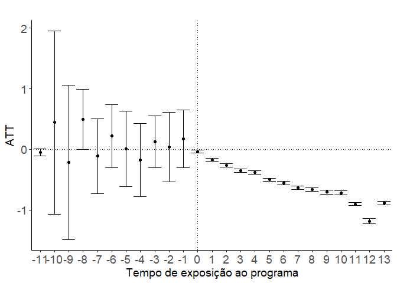

# Loading Packages


```r
# Carrega os pacotes necessários para a análise de dados
library(tidyverse)    # Pacote que inclui uma coleção de pacotes para manipulação, 
#visualização e modelagem de dados.
library(did) # Pacote criado por Callway & Sant'Anna (2022) para seu método de DiD
library(geobr) # Pacote para trabalhar com gráficos de mapa do Brasil
library(magrittr)     # Pacote que permite escrever códigos mais legíveis e 
#organizados utilizando o operador %>%
library(lubridate)    # Pacote para trabalhar com datas
library(zoo)          # Pacote para trabalhar com séries temporais
library(janitor)      # Pacote para limpeza e transformação de dados
library(readxl)       # Pacote para importar dados de arquivos do Excel
library(stargazer)    # Pacote para criar tabelas de resultados de modelos
library(ggthemes)     # Pacote para personalização de gráficos criados com ggplot2
library(viridis)      # Pacote para gerar paletas de cores para gráficos
library(GGally)       # Pacote para criação de matriz de dispersão
library(gridExtra)    # Pacote para combinar vários gráficos em uma única imagem
library(grid)         # Pacote para trabalhar com layout e alinhamento de gráficos
library(gridtext)     # Pacote para adicionar texto em gráficos gerados com grid
library(plm)          # Pacote para modelagem de dados em painel
library(tempdisagg)   # Pacote para desagregação temporal de séries de tempo
library(showtext)     # Pacote de fontes
library(forecast)     # Pacote para séries temporais
library(broom)
library(xtable)
library(modelsummary)
library(gt)
```

# Data

## Loading data

### Loading original data


```r
setwd("G:/Meu Drive/Insper/TCC")

dados_ice_v3 <- arrow::read_parquet('Dados/dados_ice_v3_limpo.parquet') %>% 
  filter(ano_enem >= 2009) %>% 
  mutate(cod_munic = as.numeric(cod_munic))

painel_indicadores <- arrow::read_parquet('Dados/painel_indicadores.parquet')

painel_indicadores_simplificado <- arrow::read_parquet('Dados/painel_indicadores_simplificado.parquet')
```


```r
dados_ice_v3_norm <- dados_ice_v3 %>% 
  mutate_at(c('enem_nota_objetiva','enem_nota_redacao', 'enem_nota_matematica', 'enem_nota_linguagens',
              'enem_nota_humanas', 'enem_nota_humanas', 'enem_nota_ciencias', 'enem_nota_objetivab'), 
            ~(scale(.) %>% as.vector))

painel_indicadores_simplificado_norm <- painel_indicadores_simplificado %>% 
  mutate_at(c('aba_em', 'dist_em', 'apr_em', 'rep_em'),  ~(scale(.) %>% as.vector))
```


```r
tema <- theme(plot.title = element_text(size = 16, face = "bold", hjust = 0.5),
              axis.line = element_line(colour = "black"),
              axis.text.y = element_text(angle = 0, size = 12, face = 'plain'),
              axis.text.x = element_text(angle = 90, size = 12, face = 'plain'),
              axis.title = element_text(size = 14, face = 'plain'),
              legend.title = element_text(size = 10),
              legend.text = element_text(size = 10),
              plot.background = element_rect(fill = alpha("white", 0.25), 
                                       color = NA),
              legend.background = element_rect(fill = "transparent", color = NA))

tema_did <- theme(plot.title = element_text(size = 16, face = "bold", hjust = 0.5),
              legend.text = element_text(size = 16),
              axis.line = element_line(colour = "black"),
              axis.text.y = element_text(angle = 0, size = 14, face = 'plain'),
              axis.text.x = element_text(angle = 0, size = 14, face = 'plain'),
              axis.title = element_text(size = 14, face = 'plain'),
              legend.title = element_text(size = 10),
              plot.background = element_rect(fill = alpha("white", 0.25), 
                                       color = NA),
              panel.background = element_rect(fill = "transparent", color = NA),
              legend.background = element_rect(fill = "transparent", color = NA))
```

# Inference

## Creating normalized effects


```r
did_redacao_norm <- did::att_gt(
  yname = "enem_nota_redacao",
  tname = "ano",
  idname = "codigo_escola",
  gname = "ano_ice", 
  data = dados_ice_v3_norm
)

did_matematica_norm <- did::att_gt(
  yname = "enem_nota_matematica",
  tname = "ano",
  idname = "codigo_escola",
  gname = "ano_ice",
  data = dados_ice_v3_norm
)

did_linguagem_norm <- did::att_gt(
  yname = "enem_nota_linguagens",
  tname = "ano",
  idname = "codigo_escola",
  gname = "ano_ice",
  data = dados_ice_v3_norm
)

did_ciencias_norm <- did::att_gt(
  yname = "enem_nota_ciencias",
  tname = "ano",
  idname = "codigo_escola",
  gname = "ano_ice",
  data = dados_ice_v3_norm
)

did_humanas_norm <- did::att_gt(
  yname = "enem_nota_humanas",
  tname = "ano",
  idname = "codigo_escola",
  gname = "ano_ice",
  data = dados_ice_v3_norm
)

did_objetiva_norm <- did::att_gt(
  yname = "enem_nota_objetivab",
  tname = "ano",
  idname = "codigo_escola",
  gname = "ano_ice",
  data = dados_ice_v3_norm
)
```


```r
did_abandono_norm <- did::att_gt(
  yname = "aba_em",
  tname = "ano",
  idname = "codigo_escola",
  gname = "ano_ice",
  data = painel_indicadores_simplificado_norm
)

did_reprovacao_norm <- did::att_gt(
  yname = "rep_em",
  tname = "ano",
  idname = "codigo_escola",
  gname = "ano_ice",
  data = painel_indicadores_simplificado_norm
)

did_aprovacao_norm <- did::att_gt(
  yname = "apr_em",
  tname = "ano",
  idname = "codigo_escola",
  gname = "ano_ice",
  data = painel_indicadores_simplificado_norm
)

did_distorcao_norm <- did::att_gt(
  yname = "dist_em",
  tname = "ano",
  idname = "codigo_escola",
  gname = "ano_ice",
  data = painel_indicadores_simplificado_norm
)
```

### Dynamic results


```r
aggte(did_redacao_norm, type = "dynamic", na.rm = T)
```

```
## 
## Call:
## aggte(MP = did_redacao_norm, type = "dynamic", na.rm = T)
## 
## Reference: Callaway, Brantly and Pedro H.C. Sant'Anna.  "Difference-in-Differences with Multiple Time Periods." Journal of Econometrics, Vol. 225, No. 2, pp. 200-230, 2021. <https://doi.org/10.1016/j.jeconom.2020.12.001>, <https://arxiv.org/abs/1803.09015> 
## 
## 
## Overall summary of ATT's based on event-study/dynamic aggregation:  
##    ATT    Std. Error     [ 95%  Conf. Int.]  
##  0.169         0.031     0.1083      0.2297 *
## 
## 
## Dynamic Effects:
##  Event time Estimate Std. Error [95% Simult.  Conf. Band]  
##          -5   0.0216     0.1137       -0.2827      0.3259  
##          -4  -0.0095     0.0545       -0.1555      0.1365  
##          -3  -0.0442     0.0410       -0.1541      0.0656  
##          -2   0.0075     0.0318       -0.0776      0.0926  
##          -1  -0.0984     0.0251       -0.1657     -0.0311 *
##           0  -0.0137     0.0302       -0.0946      0.0672  
##           1   0.0110     0.0286       -0.0654      0.0874  
##           2   0.1594     0.0303        0.0783      0.2404 *
##           3   0.3306     0.0388        0.2268      0.4344 *
##           4   0.2096     0.0611        0.0460      0.3732 *
##           5   0.3170     0.0656        0.1415      0.4925 *
## ---
## Signif. codes: `*' confidence band does not cover 0
## 
## Control Group:  Never Treated,  Anticipation Periods:  0
## Estimation Method:  Doubly Robust
```

```r
aggte(did_matematica_norm, type = "dynamic", na.rm = T)
```

```
## 
## Call:
## aggte(MP = did_matematica_norm, type = "dynamic", na.rm = T)
## 
## Reference: Callaway, Brantly and Pedro H.C. Sant'Anna.  "Difference-in-Differences with Multiple Time Periods." Journal of Econometrics, Vol. 225, No. 2, pp. 200-230, 2021. <https://doi.org/10.1016/j.jeconom.2020.12.001>, <https://arxiv.org/abs/1803.09015> 
## 
## 
## Overall summary of ATT's based on event-study/dynamic aggregation:  
##     ATT    Std. Error     [ 95%  Conf. Int.]  
##  0.1524        0.0237     0.1059      0.1989 *
## 
## 
## Dynamic Effects:
##  Event time Estimate Std. Error [95% Simult.  Conf. Band]  
##          -5  -0.0772     0.0712       -0.2658      0.1114  
##          -4  -0.0957     0.0379       -0.1961      0.0048  
##          -3  -0.1010     0.0235       -0.1634     -0.0387 *
##          -2  -0.0737     0.0198       -0.1262     -0.0211 *
##          -1   0.0163     0.0183       -0.0320      0.0647  
##           0  -0.0318     0.0183       -0.0802      0.0166  
##           1   0.0684     0.0201        0.0152      0.1216 *
##           2   0.2462     0.0248        0.1805      0.3120 *
##           3   0.3078     0.0322        0.2225      0.3931 *
##           4   0.1533     0.0426        0.0403      0.2662 *
##           5   0.1705     0.0435        0.0553      0.2858 *
## ---
## Signif. codes: `*' confidence band does not cover 0
## 
## Control Group:  Never Treated,  Anticipation Periods:  0
## Estimation Method:  Doubly Robust
```

```r
aggte(did_linguagem_norm, type = "dynamic", na.rm = T)
```

```
## 
## Call:
## aggte(MP = did_linguagem_norm, type = "dynamic", na.rm = T)
## 
## Reference: Callaway, Brantly and Pedro H.C. Sant'Anna.  "Difference-in-Differences with Multiple Time Periods." Journal of Econometrics, Vol. 225, No. 2, pp. 200-230, 2021. <https://doi.org/10.1016/j.jeconom.2020.12.001>, <https://arxiv.org/abs/1803.09015> 
## 
## 
## Overall summary of ATT's based on event-study/dynamic aggregation:  
##     ATT    Std. Error     [ 95%  Conf. Int.]  
##  0.3322        0.0314     0.2706      0.3937 *
## 
## 
## Dynamic Effects:
##  Event time Estimate Std. Error [95% Simult.  Conf. Band]  
##          -5   0.2320     0.0927       -0.0263      0.4904  
##          -4  -0.0179     0.0505       -0.1584      0.1227  
##          -3   0.0710     0.0266       -0.0030      0.1450  
##          -2   0.0099     0.0201       -0.0462      0.0660  
##          -1   0.0226     0.0214       -0.0371      0.0823  
##           0   0.0819     0.0197        0.0270      0.1368 *
##           1   0.1169     0.0236        0.0510      0.1827 *
##           2   0.3079     0.0284        0.2288      0.3870 *
##           3   0.3855     0.0390        0.2770      0.4941 *
##           4   0.5579     0.0550        0.4048      0.7110 *
##           5   0.5429     0.0642        0.3641      0.7216 *
## ---
## Signif. codes: `*' confidence band does not cover 0
## 
## Control Group:  Never Treated,  Anticipation Periods:  0
## Estimation Method:  Doubly Robust
```

```r
aggte(did_ciencias_norm, type = "dynamic", na.rm = T)
```

```
## 
## Call:
## aggte(MP = did_ciencias_norm, type = "dynamic", na.rm = T)
## 
## Reference: Callaway, Brantly and Pedro H.C. Sant'Anna.  "Difference-in-Differences with Multiple Time Periods." Journal of Econometrics, Vol. 225, No. 2, pp. 200-230, 2021. <https://doi.org/10.1016/j.jeconom.2020.12.001>, <https://arxiv.org/abs/1803.09015> 
## 
## 
## Overall summary of ATT's based on event-study/dynamic aggregation:  
##     ATT    Std. Error     [ 95%  Conf. Int.]  
##  0.3251         0.025     0.2761      0.3741 *
## 
## 
## Dynamic Effects:
##  Event time Estimate Std. Error [95% Simult.  Conf. Band]  
##          -5   0.1330     0.0825       -0.0964      0.3623  
##          -4   0.0940     0.0442       -0.0288      0.2168  
##          -3   0.0226     0.0287       -0.0572      0.1023  
##          -2   0.0016     0.0208       -0.0561      0.0594  
##          -1   0.0468     0.0186       -0.0049      0.0985  
##           0   0.0805     0.0214        0.0210      0.1401 *
##           1   0.1140     0.0213        0.0547      0.1732 *
##           2   0.3238     0.0241        0.2568      0.3909 *
##           3   0.4027     0.0318        0.3145      0.4910 *
##           4   0.4929     0.0506        0.3524      0.6334 *
##           5   0.5368     0.0576        0.3766      0.6970 *
## ---
## Signif. codes: `*' confidence band does not cover 0
## 
## Control Group:  Never Treated,  Anticipation Periods:  0
## Estimation Method:  Doubly Robust
```

```r
aggte(did_humanas_norm, type = "dynamic", na.rm = T)
```

```
## 
## Call:
## aggte(MP = did_humanas_norm, type = "dynamic", na.rm = T)
## 
## Reference: Callaway, Brantly and Pedro H.C. Sant'Anna.  "Difference-in-Differences with Multiple Time Periods." Journal of Econometrics, Vol. 225, No. 2, pp. 200-230, 2021. <https://doi.org/10.1016/j.jeconom.2020.12.001>, <https://arxiv.org/abs/1803.09015> 
## 
## 
## Overall summary of ATT's based on event-study/dynamic aggregation:  
##     ATT    Std. Error     [ 95%  Conf. Int.]  
##  0.2986        0.0235     0.2526      0.3447 *
## 
## 
## Dynamic Effects:
##  Event time Estimate Std. Error [95% Simult.  Conf. Band]  
##          -5   0.1406     0.0721       -0.0566      0.3377  
##          -4   0.0287     0.0403       -0.0815      0.1389  
##          -3   0.0450     0.0288       -0.0336      0.1237  
##          -2  -0.0169     0.0197       -0.0707      0.0369  
##          -1   0.0185     0.0198       -0.0357      0.0726  
##           0   0.0640     0.0215        0.0052      0.1228 *
##           1   0.1198     0.0206        0.0635      0.1761 *
##           2   0.3043     0.0237        0.2395      0.3691 *
##           3   0.3637     0.0335        0.2721      0.4553 *
##           4   0.4320     0.0446        0.3102      0.5538 *
##           5   0.5078     0.0458        0.3825      0.6331 *
## ---
## Signif. codes: `*' confidence band does not cover 0
## 
## Control Group:  Never Treated,  Anticipation Periods:  0
## Estimation Method:  Doubly Robust
```

```r
aggte(did_objetiva_norm, type = "dynamic", na.rm = T)
```

```
## 
## Call:
## aggte(MP = did_objetiva_norm, type = "dynamic", na.rm = T)
## 
## Reference: Callaway, Brantly and Pedro H.C. Sant'Anna.  "Difference-in-Differences with Multiple Time Periods." Journal of Econometrics, Vol. 225, No. 2, pp. 200-230, 2021. <https://doi.org/10.1016/j.jeconom.2020.12.001>, <https://arxiv.org/abs/1803.09015> 
## 
## 
## Overall summary of ATT's based on event-study/dynamic aggregation:  
##     ATT    Std. Error     [ 95%  Conf. Int.]  
##  0.2925        0.0238     0.2459      0.3391 *
## 
## 
## Dynamic Effects:
##  Event time Estimate Std. Error [95% Simult.  Conf. Band]  
##          -5   0.0987     0.0696       -0.0938      0.2911  
##          -4  -0.0059     0.0373       -0.1090      0.0973  
##          -3  -0.0016     0.0227       -0.0643      0.0611  
##          -2  -0.0277     0.0182       -0.0780      0.0226  
##          -1   0.0274     0.0169       -0.0193      0.0742  
##           0   0.0466     0.0183       -0.0039      0.0971  
##           1   0.1125     0.0183        0.0620      0.1630 *
##           2   0.3201     0.0193        0.2667      0.3736 *
##           3   0.3953     0.0289        0.3153      0.4752 *
##           4   0.4230     0.0389        0.3154      0.5306 *
##           5   0.4573     0.0487        0.3225      0.5920 *
## ---
## Signif. codes: `*' confidence band does not cover 0
## 
## Control Group:  Never Treated,  Anticipation Periods:  0
## Estimation Method:  Doubly Robust
```


```r
aggte(did_abandono_norm, type = "dynamic", na.rm = T)
```

```
## 
## Call:
## aggte(MP = did_abandono_norm, type = "dynamic", na.rm = T)
## 
## Reference: Callaway, Brantly and Pedro H.C. Sant'Anna.  "Difference-in-Differences with Multiple Time Periods." Journal of Econometrics, Vol. 225, No. 2, pp. 200-230, 2021. <https://doi.org/10.1016/j.jeconom.2020.12.001>, <https://arxiv.org/abs/1803.09015> 
## 
## 
## Overall summary of ATT's based on event-study/dynamic aggregation:  
##      ATT    Std. Error     [ 95%  Conf. Int.]  
##  -0.5681        0.0087    -0.5852     -0.5511 *
## 
## 
## Dynamic Effects:
##  Event time Estimate Std. Error [95% Simult.  Conf. Band]  
##         -11  -0.0458     0.0336       -0.1405      0.0489  
##         -10   0.4443     0.5648       -1.1475      2.0361  
##          -9  -0.2137     0.4631       -1.5190      1.0917  
##          -8   0.4961     0.1782       -0.0061      0.9983  
##          -7  -0.1123     0.2422       -0.7949      0.5703  
##          -6   0.2196     0.1769       -0.2791      0.7182  
##          -5   0.0100     0.2360       -0.6552      0.6751  
##          -4  -0.1765     0.2317       -0.8296      0.4765  
##          -3   0.1233     0.1483       -0.2947      0.5414  
##          -2   0.0397     0.2042       -0.5358      0.6153  
##          -1   0.1755     0.1773       -0.3242      0.6751  
##           0  -0.0353     0.0081       -0.0583     -0.0123 *
##           1  -0.1733     0.0094       -0.1998     -0.1468 *
##           2  -0.2673     0.0093       -0.2934     -0.2412 *
##           3  -0.3485     0.0103       -0.3774     -0.3196 *
##           4  -0.3832     0.0111       -0.4144     -0.3520 *
##           5  -0.5013     0.0108       -0.5318     -0.4708 *
##           6  -0.5562     0.0106       -0.5861     -0.5264 *
##           7  -0.6336     0.0106       -0.6636     -0.6036 *
##           8  -0.6592     0.0119       -0.6928     -0.6256 *
##           9  -0.7059     0.0108       -0.7363     -0.6754 *
##          10  -0.7176     0.0111       -0.7488     -0.6864 *
##          11  -0.9020     0.0106       -0.9317     -0.8722 *
##          12  -1.1834     0.0160       -1.2285     -1.1383 *
##          13  -0.8868     0.0120       -0.9207     -0.8529 *
## ---
## Signif. codes: `*' confidence band does not cover 0
## 
## Control Group:  Never Treated,  Anticipation Periods:  0
## Estimation Method:  Doubly Robust
```

```r
aggte(did_reprovacao_norm, type = "dynamic", na.rm = T)
```

```
## 
## Call:
## aggte(MP = did_reprovacao_norm, type = "dynamic", na.rm = T)
## 
## Reference: Callaway, Brantly and Pedro H.C. Sant'Anna.  "Difference-in-Differences with Multiple Time Periods." Journal of Econometrics, Vol. 225, No. 2, pp. 200-230, 2021. <https://doi.org/10.1016/j.jeconom.2020.12.001>, <https://arxiv.org/abs/1803.09015> 
## 
## 
## Overall summary of ATT's based on event-study/dynamic aggregation:  
##      ATT    Std. Error     [ 95%  Conf. Int.]  
##  -0.0747        0.0122    -0.0987     -0.0507 *
## 
## 
## Dynamic Effects:
##  Event time Estimate Std. Error [95% Simult.  Conf. Band]  
##         -11   0.1231     1.0533       -2.7224      2.9685  
##         -10  -0.0726     0.3354       -0.9786      0.8335  
##          -9   0.0060     0.3362       -0.9024      0.9144  
##          -8  -0.0970     0.2030       -0.6453      0.4513  
##          -7   0.3381     0.2080       -0.2238      0.9001  
##          -6  -0.3523     0.2305       -0.9750      0.2705  
##          -5  -0.0024     0.1929       -0.5235      0.5187  
##          -4   0.0770     0.1970       -0.4553      0.6093  
##          -3  -0.0335     0.1025       -0.3103      0.2433  
##          -2   0.0653     0.1686       -0.3903      0.5209  
##          -1  -0.0535     0.1161       -0.3671      0.2602  
##           0  -0.0508     0.0136       -0.0875     -0.0141 *
##           1  -0.0210     0.0137       -0.0580      0.0160  
##           2  -0.0150     0.0144       -0.0539      0.0239  
##           3   0.0169     0.0142       -0.0214      0.0552  
##           4  -0.0563     0.0146       -0.0959     -0.0167 *
##           5  -0.0567     0.0142       -0.0952     -0.0183 *
##           6  -0.0013     0.0160       -0.0445      0.0419  
##           7  -0.0186     0.0153       -0.0598      0.0227  
##           8   0.1085     0.0158        0.0658      0.1513 *
##           9   0.0667     0.0150        0.0261      0.1073 *
##          10   0.0658     0.0151        0.0249      0.1066 *
##          11  -0.0790     0.0157       -0.1215     -0.0365 *
##          12  -0.5344     0.0141       -0.5725     -0.4963 *
##          13  -0.4705     0.0145       -0.5097     -0.4314 *
## ---
## Signif. codes: `*' confidence band does not cover 0
## 
## Control Group:  Never Treated,  Anticipation Periods:  0
## Estimation Method:  Doubly Robust
```

```r
aggte(did_aprovacao_norm, type = "dynamic", na.rm = T)
```

```
## 
## Call:
## aggte(MP = did_aprovacao_norm, type = "dynamic", na.rm = T)
## 
## Reference: Callaway, Brantly and Pedro H.C. Sant'Anna.  "Difference-in-Differences with Multiple Time Periods." Journal of Econometrics, Vol. 225, No. 2, pp. 200-230, 2021. <https://doi.org/10.1016/j.jeconom.2020.12.001>, <https://arxiv.org/abs/1803.09015> 
## 
## 
## Overall summary of ATT's based on event-study/dynamic aggregation:  
##    ATT    Std. Error     [ 95%  Conf. Int.]  
##  0.422        0.0095     0.4035      0.4406 *
## 
## 
## Dynamic Effects:
##  Event time Estimate Std. Error [95% Simult.  Conf. Band]  
##         -11  -0.0519     0.3468       -1.0291      0.9253  
##         -10  -0.2430     0.5766       -1.8677      1.3816  
##          -9   0.1362     0.3552       -0.8648      1.1371  
##          -8  -0.2608     0.1965       -0.8144      0.2928  
##          -7  -0.1515     0.1185       -0.4852      0.1823  
##          -6   0.0905     0.0946       -0.1759      0.3570  
##          -5  -0.0049     0.1282       -0.3662      0.3563  
##          -4   0.0645     0.1687       -0.4107      0.5397  
##          -3  -0.0586     0.1132       -0.3776      0.2605  
##          -2  -0.0696     0.1473       -0.4845      0.3454  
##          -1  -0.0795     0.1107       -0.3915      0.2325  
##           0   0.0567     0.0098        0.0290      0.0844 *
##           1   0.1274     0.0101        0.0989      0.1559 *
##           2   0.1851     0.0103        0.1562      0.2140 *
##           3   0.2170     0.0108        0.1867      0.2474 *
##           4   0.2885     0.0107        0.2583      0.3188 *
##           5   0.3662     0.0115        0.3339      0.3986 *
##           6   0.3653     0.0108        0.3349      0.3957 *
##           7   0.4276     0.0115        0.3953      0.4599 *
##           8   0.3597     0.0112        0.3282      0.3913 *
##           9   0.4182     0.0112        0.3865      0.4499 *
##          10   0.4265     0.0119        0.3932      0.4599 *
##          11   0.6439     0.0107        0.6137      0.6741 *
##          12   1.1316     0.0127        1.0958      1.1673 *
##          13   0.8947     0.0118        0.8615      0.9278 *
## ---
## Signif. codes: `*' confidence band does not cover 0
## 
## Control Group:  Never Treated,  Anticipation Periods:  0
## Estimation Method:  Doubly Robust
```

```r
aggte(did_distorcao_norm, type = "dynamic", na.rm = T)
```

```
## Warning in compute.aggte(MP = MP, type = type, balance_e = balance_e, min_e =
## min_e, : Simultaneous critical value is arguably `too large' to be realible.
## This usually happens when number of observations per group is small and/or
## there is no much variation in outcomes.
```

```
## 
## Call:
## aggte(MP = did_distorcao_norm, type = "dynamic", na.rm = T)
## 
## Reference: Callaway, Brantly and Pedro H.C. Sant'Anna.  "Difference-in-Differences with Multiple Time Periods." Journal of Econometrics, Vol. 225, No. 2, pp. 200-230, 2021. <https://doi.org/10.1016/j.jeconom.2020.12.001>, <https://arxiv.org/abs/1803.09015> 
## 
## 
## Overall summary of ATT's based on event-study/dynamic aggregation:  
##      ATT    Std. Error     [ 95%  Conf. Int.]  
##  -0.5299        0.0072    -0.5441     -0.5157 *
## 
## 
## Dynamic Effects:
##  Event time Estimate Std. Error [95% Simult.  Conf. Band]  
##         -14   0.0871     0.0185       -0.2141      0.3882  
##         -13  -0.3634     0.0537       -1.2363      0.5095  
##         -12  -0.4464     0.2091       -3.8429      2.9502  
##         -11  -0.1718     0.1140       -2.0235      1.6799  
##         -10  -0.4864     0.2809       -5.0493      4.0765  
##          -9  -0.0402     0.2963       -4.8525      4.7722  
##          -8   0.0352     0.1603       -2.5678      2.6382  
##          -7  -0.4829     0.2563       -4.6456      3.6797  
##          -6   0.1109     0.1017       -1.5402      1.7620  
##          -5  -0.0499     0.1666       -2.7552      2.6554  
##          -4  -0.0573     0.0963       -1.6216      1.5071  
##          -3   0.0335     0.1107       -1.7641      1.8310  
##          -2   0.0665     0.0705       -1.0788      1.2119  
##          -1  -0.2941     0.0987       -1.8976      1.3093  
##           0  -0.3481     0.0073       -0.4661     -0.2301 *
##           1  -0.3112     0.0068       -0.4217     -0.2008 *
##           2  -0.2918     0.0070       -0.4056     -0.1781 *
##           3  -0.3585     0.0075       -0.4811     -0.2359 *
##           4  -0.4270     0.0080       -0.5573     -0.2966 *
##           5  -0.4944     0.0081       -0.6265     -0.3623 *
##           6  -0.5532     0.0083       -0.6873     -0.4190 *
##           7  -0.5867     0.0085       -0.7244     -0.4490 *
##           8  -0.5493     0.0090       -0.6961     -0.4025 *
##           9  -0.5505     0.0091       -0.6982     -0.4029 *
##          10  -0.5675     0.0095       -0.7214     -0.4135 *
##          11  -0.6714     0.0091       -0.8188     -0.5240 *
##          12  -0.6587     0.0097       -0.8170     -0.5005 *
##          13  -0.7263     0.0098       -0.8860     -0.5666 *
##          14  -0.8533     0.0098       -1.0121     -0.6945 *
## ---
## Signif. codes: `*' confidence band does not cover 0
## 
## Control Group:  Never Treated,  Anticipation Periods:  0
## Estimation Method:  Doubly Robust
```

### Results charts


```r
plot_did_redacao_norm <-
ggdid(aggte(did_redacao_norm, type = "dynamic", na.rm = T),       
      legend = F, ref_line = 0, theming = F)[["data"]] %>% 
    mutate(ymin = att-c*att.se, ymax=att+c*att.se, year=as.factor(year)) %>% 
    ggplot(aes(year, att)) +
    geom_point(aes(year, att)) +
    geom_errorbar(aes(ymin = ymin, ymax = ymax), size = 0.1) +
    labs(title = '',
         x = 'Tempo de exposição ao programa',
         y ='ATT') +
    geom_vline(xintercept = '0', linetype = 'dotted') +
    geom_hline(yintercept = 0, linetype = 'dotted') +
    tema_did

ggsave(plot_did_redacao_norm, 
       filename = "Plots/did_agg_redacao.png",
       device = "png",
       width=7.5,height=3.5, units = "in")

plot_did_linguagem_norm <-
ggdid(aggte(did_linguagem_norm, type = "dynamic", na.rm = T),       
      legend = F, ref_line = 0, theming = F)[["data"]] %>% 
    mutate(ymin = att-c*att.se, ymax=att+c*att.se, year=as.factor(year)) %>% 
    ggplot(aes(year, att)) +
    geom_point(aes(year, att)) +
    geom_errorbar(aes(ymin = ymin, ymax = ymax), size = 0.1) +
    labs(title = '',
         x = 'Tempo de exposição ao programa',
         y ='ATT') +
    geom_vline(xintercept = '0', linetype = 'dotted') +
    geom_hline(yintercept = 0, linetype = 'dotted') +
    tema_did

ggsave(plot_did_linguagem_norm, 
       filename = "Plots/did_agg_linguagem.png",
       device = "png",
       width=7.5,height=3.5, units = "in")

plot_did_matematica_norm <-
ggdid(aggte(did_matematica_norm, type = "dynamic", na.rm = T),       
      legend = F, ref_line = 0, theming = F)[["data"]] %>% 
    mutate(ymin = att-c*att.se, ymax=att+c*att.se, year=as.factor(year)) %>% 
    ggplot(aes(year, att)) +
    geom_point(aes(year, att)) +
    geom_errorbar(aes(ymin = ymin, ymax = ymax), size = 0.1) +
    labs(title = '',
         x = 'Tempo de exposição ao programa',
         y ='ATT') +
    geom_vline(xintercept = '0', linetype = 'dotted') +
    geom_hline(yintercept = 0, linetype = 'dotted') +
    tema_did

ggsave(plot_did_matematica_norm, 
       filename = "Plots/did_agg_matematica.png",
       device = "png",
       width=7.5,height=3.5, units = "in")

plot_did_humanas_norm <-
ggdid(aggte(did_humanas_norm, type = "dynamic", na.rm = T),       
      legend = F, ref_line = 0, theming = F)[["data"]] %>% 
    mutate(ymin = att-c*att.se, ymax=att+c*att.se, year=as.factor(year)) %>% 
    ggplot(aes(year, att)) +
    geom_point(aes(year, att)) +
    geom_errorbar(aes(ymin = ymin, ymax = ymax), size = 0.1) +
    labs(title = '',
         x = 'Tempo de exposição ao programa',
         y ='ATT') +
    geom_vline(xintercept = '0', linetype = 'dotted') +
    geom_hline(yintercept = 0, linetype = 'dotted') +
    tema_did

ggsave(plot_did_humanas_norm, 
       filename = "Plots/did_agg_humanas.png",
       device = "png",
       width=7.5,height=3.5, units = "in")

plot_did_ciencias_norm <-
ggdid(aggte(did_ciencias_norm, type = "dynamic", na.rm = T),       
      legend = F, ref_line = 0, theming = F)[["data"]] %>% 
    mutate(ymin = att-c*att.se, ymax=att+c*att.se, year=as.factor(year)) %>% 
    ggplot(aes(year, att)) +
    geom_point(aes(year, att)) +
    geom_errorbar(aes(ymin = ymin, ymax = ymax), size = 0.1) +
    labs(title = '',
         x = 'Tempo de exposição ao programa',
         y ='ATT') +
    geom_vline(xintercept = '0', linetype = 'dotted') +
    geom_hline(yintercept = 0, linetype = 'dotted') +
    tema_did

ggsave(plot_did_ciencias_norm, 
       filename = "Plots/did_agg_ciencias.png",
       device = "png",
       width=7.5,height=3.5, units = "in")

plot_did_objetiva_norm <-
ggdid(aggte(did_objetiva_norm, type = "dynamic", na.rm = T),       
      legend = F, ref_line = 0, theming = F)[["data"]] %>% 
    mutate(ymin = att-c*att.se, ymax=att+c*att.se, year=as.factor(year)) %>% 
    ggplot(aes(year, att)) +
    geom_point(aes(year, att)) +
    geom_errorbar(aes(ymin = ymin, ymax = ymax), size = 0.1) +
    labs(title = '',
         x = 'Tempo de exposição ao programa',
         y ='ATT') +
    geom_vline(xintercept = '0', linetype = 'dotted') +
    geom_hline(yintercept = 0, linetype = 'dotted') +
    tema_did

ggsave(plot_did_objetiva_norm, 
       filename = "Plots/did_agg_objetiva.png",
       device = "png",
       width=7.5,height=3.5, units = "in")
```


```r
plot_did_redacao_norm
```

<!-- -->

```r
plot_did_linguagem_norm
```

<!-- -->

```r
plot_did_matematica_norm
```

<!-- -->

```r
plot_did_humanas_norm
```

<!-- -->

```r
plot_did_ciencias_norm
```

<!-- -->

```r
plot_did_objetiva_norm
```

<!-- -->


```r
plot_did_aprovacao_norm <-
ggdid(aggte(did_aprovacao_norm, type = "dynamic", na.rm = T),       
      legend = F, ref_line = 0, theming = F)[["data"]] %>% 
    mutate(ymin = att-c*att.se, ymax=att+c*att.se, year=as.factor(year)) %>% 
    ggplot(aes(year, att)) +
    geom_point(aes(year, att)) +
    geom_errorbar(aes(ymin = ymin, ymax = ymax), size = 0.1) +
    labs(title = '',
         x = 'Tempo de exposição ao programa',
         y ='ATT') +
    geom_vline(xintercept = '0', linetype = 'dotted') +
    geom_hline(yintercept = 0, linetype = 'dotted') +
    tema_did

ggsave(plot_did_aprovacao_norm, 
       filename = "Plots/did_agg_aprovacao.png",
       device = "png",
       width=7.5,height=3.5, units = "in")

plot_did_reprovacao_norm <-
ggdid(aggte(did_reprovacao_norm, type = "dynamic", na.rm = T),       
      legend = F, ref_line = 0, theming = F)[["data"]] %>% 
    mutate(ymin = att-c*att.se, ymax=att+c*att.se, year=as.factor(year)) %>% 
    ggplot(aes(year, att)) +
    geom_point(aes(year, att)) +
    geom_errorbar(aes(ymin = ymin, ymax = ymax), size = 0.1) +
    labs(title = '',
         x = 'Tempo de exposição ao programa',
         y ='ATT') +
    geom_vline(xintercept = '0', linetype = 'dotted') +
    geom_hline(yintercept = 0, linetype = 'dotted') +
    tema_did

ggsave(plot_did_reprovacao_norm, 
       filename = "Plots/did_agg_reprovacao.png",
       device = "png",
       width=7.5,height=3.5, units = "in")

plot_did_distorcao_norm <-
ggdid(aggte(did_distorcao_norm, type = "dynamic", na.rm = T),       
      legend = F, ref_line = 0, theming = F)[["data"]] %>% 
    mutate(ymin = att-c*att.se, ymax=att+c*att.se, year=as.factor(year)) %>% 
    ggplot(aes(year, att)) +
    geom_point(aes(year, att)) +
    geom_errorbar(aes(ymin = ymin, ymax = ymax), size = 0.1) +
    labs(title = '',
         x = 'Tempo de exposição ao programa',
         y ='ATT') +
    geom_vline(xintercept = '0', linetype = 'dotted') +
    geom_hline(yintercept = 0, linetype = 'dotted') +
    tema_did

ggsave(plot_did_distorcao_norm, 
       filename = "Plots/did_agg_distorcao.png",
       device = "png",
       width=7.5,height=3.5, units = "in")

plot_did_abandono_norm <-
ggdid(aggte(did_abandono_norm, type = "dynamic", na.rm = T),       
      legend = F, ref_line = 0, theming = F)[["data"]] %>% 
    mutate(ymin = att-c*att.se, ymax=att+c*att.se, year=as.factor(year)) %>% 
    ggplot(aes(year, att)) +
    geom_point(aes(year, att)) +
    geom_errorbar(aes(ymin = ymin, ymax = ymax), size = 0.1) +
    labs(title = '',
         x = 'Tempo de exposição ao programa',
         y ='ATT') +
    geom_vline(xintercept = '0', linetype = 'dotted') +
    geom_hline(yintercept = 0, linetype = 'dotted') +
    tema_did

ggsave(plot_did_abandono_norm, 
       filename = "Plots/did_agg_abandono.png",
       device = "png",
       width=7.5,height=3.5, units = "in")
```


```r
plot_did_aprovacao_norm
```

<!-- -->

```r
plot_did_reprovacao_norm
```

<!-- -->

```r
plot_did_distorcao_norm
```

<!-- -->

```r
plot_did_abandono_norm
```

<!-- -->
